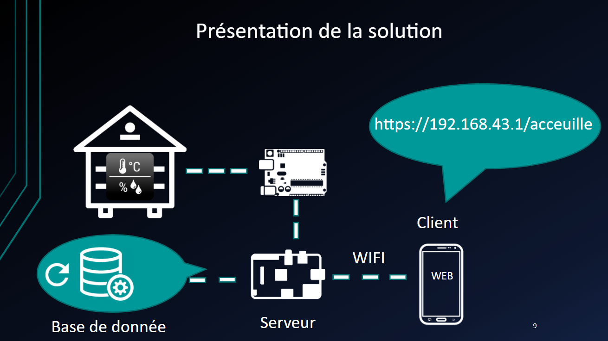
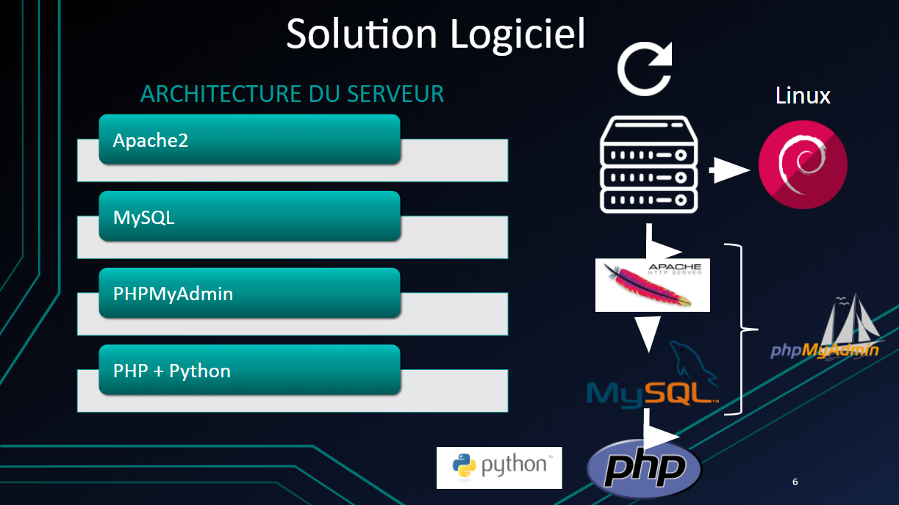

# RucheBac2018

## Objectif

## **Matériels utilisé pour faire le serveur**

## -capteur t°/humidité/mas

## -module GSM

## -Arduinos (Mega ou uno)

## -Raspberry PI 3 (sous raspbian)

## -Carte SD 8Go

## -Alimentation 5V 2A (conseiller)

## **Langage utilisés**

## **Backend**

### Python

### PHP

## **Frontend**

### HTML/CSS

### JavaScript

